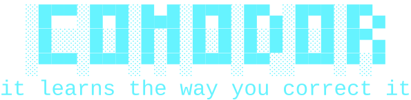

<div align="center">

# Comodor

**The coding agent that stops making the same mistake.**

Fix something it wrote, and it never writes it that way again — in this project
or the next one. Not a setting you turn on. Not a file you maintain.

[](https://pypi.org/project/comodor/)
[](https://pypi.org/project/comodor/)
[](https://github.com/ifekri/Comodor/actions/workflows/ci.yml)
[](LICENSE)

[](/docs/README.md)
[ Docs")](/docs/FA/README.md)
[](/docs/AR/README.md)
[](/docs/TR/README.md)
[](/docs/DE/README.md)
[](/docs/ES/README.md)
[](/docs/RU/README.md)
[](/docs/FR/README.md)
[](/docs/ZH/README.md)

[](https://comodor.ai)

[](#windows 'Install Comodor on Windows')
[](#linux--macos 'Install Comodor on Mac')
[](#linux--macos 'Install Comodor on Linux')
[](#install-with-uv 'Install Comodor with UV')
[](#install-with-pip 'Install Comodor with PIP')
[](#install-with-pipx 'Install Comodor with PIPX')

---

[]()

[](https://comodor.ai 'Comodor.ai Install in Linux and Mac')

</div>

## Why this one

Every agent forgets. You correct the same thing on Monday and again on Friday,
because the correction went into a conversation that ended.

Comodor watches what you do to its output. Change a name it chose, rewrite a
function it wrote, tell it *no, use the existing helper* — it works out the rule
behind the correction, tells you the rule it wrote, and follows it from then on.

```
◈ learned: naming.functions Name functions in snake_case. 6 of 6 definitions
◈ learned: line.length Keep lines within about 79 characters. 95% of lines are under 79
◈ learned: quotes.style Use double quotes for string literals. 176 of 176 literals
```

Those are real, read out of a working install.

`/progress` shows whether that is actually working — corrections per turn,
falling or not. A number, not a claim.

## Whether it is any good, measured

Most coding agents ask you to take their quality on trust. Comodor has a
benchmark: thirteen tasks in thirteen real repositories, judged by programs —
the suite goes green, the file parses, the old name is gone from every file.
Three attempts each, reported as a rate, because a single run dressed up as
"it passes" is a made-up number.

Results are committed under `bench/results/`, dated and named for the model
they are about, as JSON and as a table.

The first version of that table was wrong, and the correction is the point.
One `careful` task scored a model 0/3 for not asking a question — and the model
had in fact found the ambiguity, resolved it from the codebase's own
convention, and said so. The judge was demanding a question Comodor's prompt
tells the model *not* to ask. A judge with a made-up standard is the same bug
as a test with made-up keys, pointed the other way: one passes broken code, the
other fails correct work, and both look exactly like a real number. The task
was replaced with one whose missing piece genuinely is not in the repository.

The whole table, and how to run it against your own model, is in
[`bench/`](bench/README.md). Every number there came from a real run.

## Everything else it does

| | |
|---|---|
| **Asks instead of guessing** | When a request reads two ways it settles what it can by reading your code, then puts the rest as one short form — before writing anything. [→](docs/questions.md) |
| **Never surprises you** | Reading is silent. Writing shows a diff. Commands ask. Every change is checkpointed and `/undo` puts it back. [→](docs/safety.md) |
| **Drives a real browser** | One that runs JavaScript, keeps cookies and can log in — not a page fetcher. [→](docs/browser.md) |
| **Uses your screen** | Mouse and keyboard in any application, with a halo showing where it is about to click before it clicks. [→](docs/computer.md) |
| **Runs on your phone** | Telegram, Slack or WhatsApp — the whole interface as buttons, running in the background whether or not a terminal is open. Read-only until you say otherwise. [→](docs/telegram.md) · [→](docs/slack.md) · [→](docs/whatsapp.md) |
| **Runs a model locally** | Pick one, watch it download, use it with the network unplugged. No key, no account. [→](docs/local-models.md) |
| **Lives in your editor** | Speaks ACP, so VS Code, JetBrains and Zed drive it from their own panels. [→](docs/acp.md) |
| **Follows your procedures** | Write a skill once; it loads when the work matches. 147 ready to install. [→](docs/skills.md) |
| **Works with any model** | Sixteen hosted providers and three local runtimes, or anything with an OpenAI-compatible URL. [→](docs/models.md) |
| **Costs less** | 86% of input tokens served from cache, measured — not estimated. [→](docs/cost.md) |

**One dependency.** The HTTP client, the SSE reader, the WebSocket that drives
Chrome, the PNG encoder for screenshots, the Telegram client — all written here.
Installing Comodor pulls in `rich` and nothing else.

## Install (Recommended)

### Linux / MacOS

```bash
curl -fsSL get.comodor.ai | sh
```

### Windows

```bash
irm get.comodor.ai | iex
```

The one-liner above finds a Python, builds an isolated environment, puts
`comodor` on your `PATH`, and fetches a Python if there is none. Verified on a
bare `debian:bookworm-slim` with nothing installed.

Already have a package manager you like?

### Install With [uv](https://docs.astral.sh/uv/getting-started/installation/ 'UV Installation Docs')

```bash
uv tool install comodor
```

> [!NOTE]
> can use : `uv pip install comodor`


### Install With [pip](https://pip.pypa.io/en/stable/installation/ 'pip installation docs')

```bash
pip install comodor
```

> [!NOTE]
> linux on python3 use : `pip3 install comodor`


### Install With [pipx](https://pipx.pypa.io/latest/how-to/install-pipx.html 'How to Install pipx')

```bash
pipx install comodor
```

### In Docker — nothing to install

The agent, a real Chromium, git and ripgrep, in one container. It starts the
**browser interface** and prints the address to open:

```bash
git clone https://github.com/ifekri/Comodor.git && cd Comodor
export ANTHROPIC_API_KEY=...        # or OPENAI_API_KEY, OPENROUTER_API_KEY, ...
docker compose up
```

```
  Comodor is at  http://127.0.0.1:8765/?token=...
  Working in     /work
```

Open the link. The token is new every run, so use the one from *this* run —
`docker compose logs comodor` prints it again.

The agent works on `./work`; point it somewhere else with
`COMODOR_WORKDIR=/path/to/project docker compose up`. Or without cloning
anything:

```bash
docker run --rm -it -p 127.0.0.1:8765:8765 \
  -e ANTHROPIC_API_KEY -v "$PWD:/work" ifekri/comodor:latest
```

Published to both [Docker Hub](https://hub.docker.com/r/ifekri/comodor)
(`ifekri/comodor`) and GitHub (`ghcr.io/ifekri/comodor`) on every release.

Full details, including how to reach it from another machine safely:
[Docker](docs/docker.md).

Then `comodor`. Python 3.11 or newer. Six questions the first time, never
again.

**No API key?** `comodor --demo` runs the whole interface offline. Or pick a
local model in the setup and pay nothing, ever.

**Coming from OpenClaw or Hermes?** The first screen offers to bring your keys
and skills across. [How that works](docs/migrating.md).

## Using it

```bash
comodor                                    # the interface
comodor run "fix the failing test" --yes   # one task, no interface
comodor web                                # from a browser
comodor telegram start                     # from your phone
comodor acp                                # from your editor
comodor doctor                             # is everything alright?
```

```
/help      every command          /undo      restore the last change
/mode      act · plan · chat      /progress  proof it is improving
/cost      tokens and spend       /computer  let it use your screen
Esc        stop it                F3         cycle mode
```

## Documentation

**[docs/README.md](docs/README.md)** — organised by what you are trying to do.

| | |
|---|---|
| [Getting started](docs/getting-started.md) | Install, choose a model, first task |
| [The interface](docs/interface.md) | Panels, keys, and all 29 commands |
| [How it learns](docs/learning.md) | Corrections, rules, and the evidence |
| [What it can do](docs/tools.md) | The 13 tools, and when it uses each |
| [Safety and permissions](docs/safety.md) | What it asks, and what it never does |
| [From your phone](docs/telegram.md) | The Telegram bot, and who it answers |
| [From Slack](docs/slack.md) | Socket Mode — five minutes, and no public address |
| [From WhatsApp](docs/whatsapp.md) | The Cloud API — longer to set up; Telegram does the same thing |
| [Models on your machine](docs/local-models.md) | Downloading one, running it offline |
| [Configuration](docs/configuration.md) | Every setting, and what wins |
| [Cost](docs/cost.md) | Caching, budgets, paying less |
| [Troubleshooting](docs/troubleshooting.md) | When something is wrong |

## Development

```bash
git clone https://github.com/ifekri/Comodor.git
cd Comodor
uv venv && uv pip install -e ".[dev]"
uv run pytest -q
uv run ruff check .
```

Both pass on Linux and Windows before anything is pushed.
[CONTRIBUTING.md](CONTRIBUTING.md)

## Licence

MIT — [LICENSE](LICENSE).
Security: [SECURITY.md](SECURITY.md), please not a public issue.
